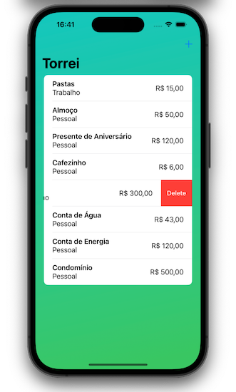

# Torrei

A simple solution to easily and intuitively track your daily expenses.

## Our Goal

To build a simple iOS app that can track my daily expenses and separates personal costs from business costs in order to reduce the time spent wondering where I spent my money.

## What I learn

- Present and dismiss a second screen of data.
- Delete rows from a list.
- Error handling in Swift.
- Save and load user data.
- Basic debugging.

…and more.

> This is a project made from The [100DaysOfSwiftUI](https://www.hackingwithswift.com/100/swiftui), check my portfolio at [andreporto.vercel.app](https://andreporto.vercel.app)
